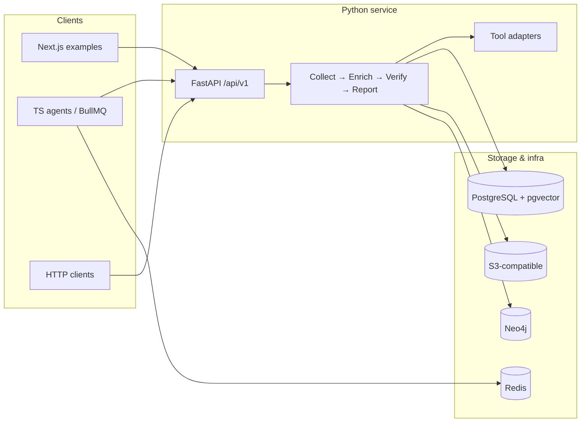

<p align="center">
  
  
</p>

<p align="center">
  <strong>Agentic Open Source Intelligence (OSINT)</strong><br />
  Evidence-first pipelines, AI-orchestrated tools, and analyst-ready reporting—built for teams that need corroboration, audit trails, and clear authorization boundaries.
</p>

<p align="center">
  <a href="LICENSE"></a>
  
  
</p>

---

## Overview

**Grond** is a hybrid **Python + TypeScript** platform for structured OSINT:

- **Python (`src/`)** — [FastAPI](https://fastapi.tiangolo.com/) service, tool adapters (Shodan, Tavily, optional X/Twitter, SEC EDGAR, metadata helpers, and more), and a **collect → enrich → verify → report** pipeline ([LangGraph](https://langchain-ai.github.io/langgraph/)–backed orchestration in `src/core/orchestrator.py`). Outputs are modeled as **evidence with provenance**, not unconstrained LLM invention.
- **TypeScript (`orchestration/`)** — Agentic loops via **Claude Agent SDK** or **OpenRouter**, HTTP clients into the same FastAPI surface, optional **BullMQ** workers, and **Neo4j** helpers for graph-oriented workflows.
- **Example UIs** — Next.js analyst console and supplementary examples under `examples/`.

Passive collection respects provider terms and rate limits. **Active probing** (e.g. Nmap) is gated by explicit authorization and human-in-the-loop flags—see [Security & ethics](#security--ethics) and [`docs/security-authorization.md`](docs/security-authorization.md).

## Table of contents

- [Who this is for](#who-this-is-for)
- [Features](#features)
- [Architecture](#architecture)
- [Repository layout](#repository-layout)
- [Maturity overview](#maturity-overview)
- [Personas & deployment profiles](#personas--deployment-profiles)
- [Requirements](#requirements)
- [Quick start](#quick-start)
- [Configuration](#configuration)
- [TypeScript orchestration & queue](#typescript-orchestration--queue)
- [Example applications](#example-applications)
- [Active scans & authorization](#active-scans--authorization)
- [Observability & production](#observability--production)
- [Development & testing](#development--testing)
- [Documentation & agent guidance](#documentation--agent-guidance)
- [Security & ethics](#security--ethics)
- [License](#license)

## Who this is for

Grond is designed for teams that need **evidence-first OSINT** with clear guardrails, not just another LLM demo.

**Typical personas:**

- **Threat intel / SOC teams** — Need to collect, corroborate, and report on infrastructure (domains, IPs, orgs) with audit trails, explicit authorization boundaries, and repeatable playbooks.
- **Red teams / offensive security (with explicit authorization)** — Want to combine passive OSINT (Shodan, web search) with carefully constrained active recon (Nmap, etc.) behind human-in-the-loop and server-side authorization.
- **Investigative analysts & research units** — Need structured, citable reports built from public data, with a clear separation between raw evidence, enrichment, and narrative.
- **Developer teams integrating OSINT into products** — Want a FastAPI surface and TypeScript orchestration layer they can extend with custom tools, storage backends, or bespoke UIs.

**Non-goals:**

- General-purpose chat assistant.
- Unconstrained autonomous scanning or exploitation.
- "Black box" intelligence with no provenance or auditability.

## Features

| Area | Capabilities |
|------|----------------|
| **Pipeline** | Parallel collection, enrichment (e.g. corroboration, domain relevance), verification, deterministic **IntelReport** construction plus LLM narrative where configured |
| **OSINT tools** | Shodan, Tavily (including investigation profiles / time ranges), optional **X API v2** (Twitter), `python-nmap` for authorized scans, harvester/metadata/SEC helpers as implemented in `src/tools/` |
| **Data plane** | PostgreSQL (+ **pgvector**), optional **Qdrant**, **Redis** (queues), **Neo4j** (entity graph), **S3-compatible** artifacts, optional OpenSearch |
| **Observability** | OpenTelemetry-friendly instrumentation, structured logging (`structlog` / `pino`), optional Sentry |
| **Governance** | Audit-oriented logging, active-scan authorization (env CSV, optional DB grants, admin route)—see [`docs/security-authorization.md`](docs/security-authorization.md) |

## Architecture

At a high level, analysts or automation hit the **FastAPI** surface; the Python pipeline owns tool execution and persistence; TypeScript agents can drive the same API and enqueue work.



## Repository layout

| Path | Role |
|------|------|
| `src/api/` | FastAPI application entrypoints and routes |
| `src/core/` | Settings, authorization, audit, orchestration state |
| `src/tools/` | OSINT and utility adapters (async, audited) |
| `src/pipeline/` | Collector, enricher, verifier, reporter stages |
| `src/models/` | Pydantic evidence and report models |
| `orchestration/` | TypeScript agents, BullMQ job helpers, graph client, tool wrappers |
| `examples/grond-dashboard/` | Primary analyst-oriented Next.js UI |
| `examples/company-research-ui/` | Additional Tavily/company-style example (see its README) |
| `agents/` | Markdown agent prompts / playbooks for use in Cursor or other IDEs |
| `.cursor/rules/` | Project and security guardrails for AI-assisted development |
| `docs/` | Operational notes (authorization, incident response) |
| `recon/` | Optional **local** build scripts for Nmap/Ncrack/Npcap upstream trees (sources are gitignored; see `recon/README.md`) |

## Maturity overview

Grond ships with a detailed [MATURITY_REPORT.md](MATURITY_REPORT.md) that tracks how production-ready different components are (overall score **2.67 / 4.0 — Moderate**).

| Area | Status | Notes |
|------|--------|-------|
| FastAPI core (`src/api/`) | **Stable** | Primary integration surface; all tool endpoints wired. |
| Pipeline (`src/pipeline/`) | **Stable / Beta** | Core collect→enrich→verify→report stages stable; new flows in Beta. |
| OSINT tools (`src/tools/`) | **Mixed** | Shodan, Tavily, stego hardened; Twitter, harvester, metadata experimental. |
| TS orchestration (`orchestration/`) | **Beta** | Interfaces may change as agents evolve; treat API contract as stable. |
| Analyst dashboard (`examples/grond-dashboard/`) | **Beta** | Good for demos; UI routes may move. |

If building on Grond for production: start with the **FastAPI surface + stable tools**; treat Beta/Experimental components as opt-in.

## Personas & deployment profiles

### Analyst desktop (single-node lab)

For an individual analyst or small team exploring Grond:

- **Goal:** FastAPI + optional Next.js dashboard on a single machine.
- **Skip for now:** Neo4j, Qdrant, BullMQ workers, S3.
- Set `DATABASE_URL`, `SHODAN_API_KEY`, `TAVILY_API_KEY`, `SECRET_KEY`, and `CORS_ORIGINS` in `.env`. Leave graph/embedding vars commented out.

```bash
git clone https://github.com/daemon-blockint-tech/Grond.git
cd Grond
uv sync --extra dev
cp .env.example .env   # fill SHODAN_API_KEY, TAVILY_API_KEY, DATABASE_URL, SECRET_KEY
uv run uvicorn src.api.main:app --host 127.0.0.1 --port 8000 --reload --env-file .env
```

### Backend-focused development

For Python developers extending tools, models, or the pipeline:

- Work in `src/api/`, `src/tools/`, `src/pipeline/`, `src/models/`, `src/core/`.
- Redis, Neo4j, and the TypeScript orchestration layer are **not required** to start.
- Add a tool in `src/tools/`, wire it into the API, then `uv run pytest` + `uv run ruff check .` before opening a PR.

### Agent / orchestration development

For TypeScript developers building agents and queues:

- Run the Python API locally, then in a separate shell:

```bash
cd orchestration
npm ci
# Configure GROND_API_URL, Redis, and LLM keys in your env
npm run dev
```

- New agents must use **pino** for logging, declare explicit timeouts and retry behavior, and treat the FastAPI surface as a versioned contract (see `orchestration/` README).

### Full-stack demo (API + dashboard)

For showing Grond to stakeholders end-to-end:

```bash
cd examples/grond-dashboard
cp .env.example .env.local
# Set NEXT_PUBLIC_GROND_API_URL=http://127.0.0.1:8000 (or your deployed API URL)
npm ci
npm run dev
```

This gives an **analyst console** (Intel / Recon / Datasheet tabs) without needing the TypeScript orchestration layer to be fully wired in. Ensure `CORS_ORIGINS` on the API side includes your dashboard origin.

## Requirements

- **Python 3.12+** (enforced in `pyproject.toml`). Use [`uv`](https://docs.astral.sh/uv/) as recommended; avoid running the API with an older system `python`/`uvicorn`.
- **Node.js** (e.g. 22.x) for `orchestration/` and Next.js examples when you build or run them locally.
- Backing services as needed: PostgreSQL, Redis, Neo4j, object storage, etc. (see `.env.example`).

## Quick start

### 1. Clone and install (Python)

```bash
git clone https://github.com/daemon-blockint-tech/Grond.git
cd Grond
uv sync --extra dev
```

Alternative, if your default `python` is 3.12+:

```bash
pip install -e ".[dev]"
```

### 2. Environment

```bash
cp .env.example .env
```

Edit `.env` with API keys and service URLs (Shodan, Tavily, optional Anthropic/OpenRouter, database, `SECRET_KEY`, etc.). Never commit real `.env` files.

### 3. Run the API

From **repository root** (so `src/` resolves correctly). Pass **`--env-file .env`** so variables such as `CORS_ORIGINS` are available when the app imports settings:

```bash
uv run uvicorn src.api.main:app --host 127.0.0.1 --port 8000 --reload --env-file .env
```

- **Health:** [http://127.0.0.1:8000/api/v1/health](http://127.0.0.1:8000/api/v1/health)
- **OpenAPI docs:** [http://127.0.0.1:8000/docs](http://127.0.0.1:8000/docs)

If port `8000` is busy, pick another `--port` and point your clients at the same URL.

**Common issue:** `TypeError` involving `str | None` or union syntax means the process is not using Python **3.12+**. Fix by using `uv run uvicorn …` after `uv sync`, not a globally installed older interpreter.

## Configuration

`.env.example` is the authoritative checklist. Notable groups:

- **OSINT:** `SHODAN_API_KEY`, `TAVILY_API_KEY`, optional `TWITTER_BEARER_TOKEN`, etc.
- **LLM:** `ANTHROPIC_API_KEY` (and/or OpenRouter-related vars used by `orchestration/` if enabled)
- **Data:** `DATABASE_URL`, `REDIS_URL`, `NEO4J_URI`, embedding backend (`EMBEDDING_BACKEND`, Qdrant URL if applicable)
- **Artifacts:** `S3_*` for S3-compatible storage
- **CORS:** `CORS_ORIGINS` for browser-based UIs (e.g. `http://localhost:3000`)
- **Active scan authorization:** `GROND_AUTHORIZED_SCAN_TARGETS`, optional DB-backed grants and admin key—documented in [`docs/security-authorization.md`](docs/security-authorization.md)

## TypeScript orchestration & queue

```bash
cd orchestration
npm ci
# Configure GROND_API_URL, Redis, LLM keys per your deployment; see orchestration README patterns and .env.example alignment
```

The orchestration package drives **`POST /api/v1/scan`** and tool routes, optionally processes **BullMQ** jobs, and integrates **OpenTelemetry** spans across HTTP boundaries where configured.

## Example applications

### Analyst dashboard (recommended)

```bash
cd examples/grond-dashboard
cp .env.example .env.local
# Set NEXT_PUBLIC_GROND_API_URL to where the browser reaches the API (e.g. http://127.0.0.1:8000)
npm ci
npm run dev
```

Ensure `CORS_ORIGINS` on the API includes your dev origin (e.g. `http://localhost:3000`). See [`examples/grond-dashboard/README.md`](examples/grond-dashboard/README.md) for build notes.

**Dashboard tabs:**

| Tab | What it does |
|-----|-------------|
| **Intel** | Agentic OSINT chat — send a target or question, receive an AI-orchestrated evidence thread with source attribution and confidence scores. |
| **Recon** | Structured tool cards — run Shodan, Tavily, Twitter, theHarvester, metadata extraction, and steganography analysis against individual targets. |
| **Datasheet** | Company/entity enrichment — bulk enrich a list of entities (e.g. company names) against a custom prompt, with results as readable bullets, source chips, and CSV export. |

### Company research UI

Additional example under `examples/company-research-ui/` — follow that directory's README for Tavily-oriented flows.

## Active scans & authorization

**Nmap and similar active tools are only for targets with explicit written authorization.** Grond enforces:

- Server-side **authorization** checks (`GROND_AUTHORIZED_SCAN_TARGETS`, optional PostgreSQL grants, patterns for domains/CIDRs—see [`docs/security-authorization.md`](docs/security-authorization.md))
- **Human-in-the-loop** and environment gates for development (e.g. `GROND_DEV_BYPASS_NMAP_HITL` only where appropriate)

For local experimentation, set `ENVIRONMENT=development`, configure authorized targets to match your lab scope, and never point active scans at systems you do not own or lack permission to test.

## Observability & production

Grond emits **OpenTelemetry**-compatible spans and **structlog** (Python) / **pino** (TypeScript) structured logs.

**Recommended minimal production setup:**

1. Run an [OpenTelemetry Collector](https://opentelemetry.io/docs/collector/) sidecar and set `OTEL_EXPORTER_OTLP_ENDPOINT` in `.env`.
2. Export traces to Jaeger, Grafana Tempo, or any OTLP-compatible backend.
3. Use Prometheus + Grafana for service metrics (latency, error rate, queue depth via BullMQ metrics).
4. Set `SENTRY_DSN` for error capture (optional but recommended in staging/prod).

**Degradation paths** — Grond is designed to degrade gracefully:

| Service down | Impact |
|---|---|
| Neo4j not configured | Graph indexing skipped; pipeline continues, no entity graph written. |
| Qdrant not configured | Semantic search disabled; pgvector used if `EMBEDDING_BACKEND=pgvector`. |
| Redis unavailable | BullMQ workers cannot start; direct FastAPI calls still work. |
| S3 not configured | Artifact storage skipped; evidence persisted to PostgreSQL only. |

**API contract (Python ↔ TypeScript):** All inter-layer calls use the FastAPI surface. Key contracts:

- `POST /api/v1/scan` — primary agentic scan entry point; accepts `{target, analyst_id, session_id}`.
- `POST /api/v1/tools/{tool}` — individual tool endpoints; input schemas defined in `src/tools/`.
- `POST /api/v1/report` — report generation from collected evidence.
- `GET /api/v1/health` — returns `{"status": "ok"}`.

TypeScript orchestration should pass the `traceparent` header (W3C Trace Context) so OTel spans are linked across the boundary.

## Development & testing

```bash
# From repo root (Python)
uv sync --extra dev
uv run ruff check .
uv run pytest
```

Continuous integration (`.github/workflows/ci.yml`) runs **pytest** and builds **`examples/grond-dashboard`** on pushes and pull requests.

## Documentation & agent guidance

| Resource | Purpose |
|----------|---------|
| [`CLAUDE.md`](CLAUDE.md) / [`AGENTS.md`](AGENTS.md) | Maintainer-oriented map and conventions |
| [`docs/security-authorization.md`](docs/security-authorization.md) | Authorization model and admin endpoints |
| [`docs/incident-response.md`](docs/incident-response.md) | Incident checklist |
| [`agents/`](agents/) | OSINT and reporting agent playbooks |
| [`.cursor/rules/`](.cursor/rules/) | IDE agent rules (ethics, core architecture, Twitter OSINT patterns) |

## Security & ethics

- **Passive OSINT** (e.g. Shodan, public web search) must still comply with provider terms and applicable law.
- **Active scanning** requires **explicit authorization**; do not bypass audit or throttle controls.
- **PII** and sensitive findings require appropriate legal basis, retention, and analyst review.
- Details: [`.cursor/rules/security-ethics.mdc`](.cursor/rules/security-ethics.mdc) and [`docs/security-authorization.md`](docs/security-authorization.md).

## Logo assets

| File | Use case |
|------|----------|
| [`Grond_White_Logo.svg`](Grond_White_Logo.svg) | Dark backgrounds, dark GitHub theme |
| [`Grond_Black_Logo.svg`](Grond_Black_Logo.svg) | Light backgrounds, light GitHub theme |

The header uses GitHub’s theme-aware image fragments (`#gh-dark-mode-only` / `#gh-light-mode-only`) so [`Grond_White_Logo.svg`](Grond_White_Logo.svg) appears on dark UI and the black mark on light UI.

## License

MIT — see [LICENSE](LICENSE).
